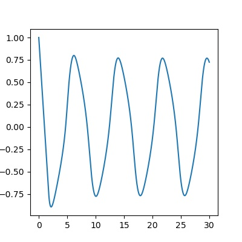
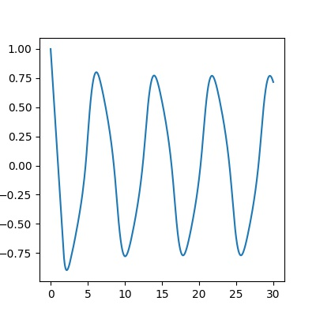
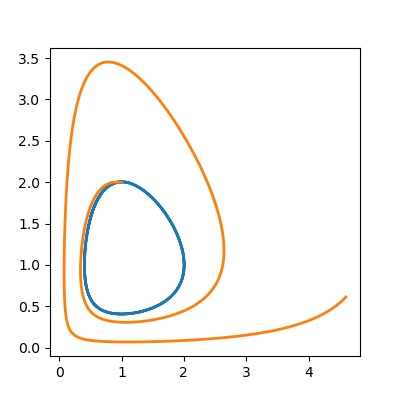
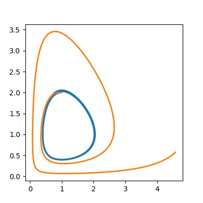
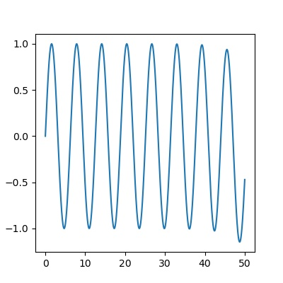
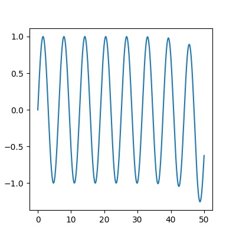

# DDEsolver

[](https://opensource.org/licenses/MIT)

Scipy-based delay differential equation (DDE) solver. See the docstrings and examples for more infos.

## Examples

### A simple DDE example

This example is meant to illustrate the solver capabilities of this module as well as how this module can be invoked and what needs to be provided.

```python
# We solve the following system:
# Y(t) = 1 for t < 0
# dY/dt = -Y(t - 3cos(t)**2) for t > 0
from pylab import cos, linspace, subplots
from ddesolver import solve_dde


def model(Y, t):
    return -Y(t - 3 * cos(Y(t)) ** 2)


def values_before_zero(t):
    return 1


tt = linspace(0, 30, 2000)
yy = solve_dde(model, values_before_zero, tt)

fig, ax = subplots(1, figsize=(4, 4))
ax.plot(tt, yy)
ax.figure.savefig("variable_delay.jpeg")

```

The following two outputs are that by this module (left) and ddeint by Zulko (right).

 

### Lotka Volterra system

This example solves a delayed Lotka–Volterra system with different delays to illustrate how to retain control over parameters of the model system and how delay can affect the results of the solver.

```python
"""
    We solve the delayed Lotka-Volterra system defined as

        For t < 0:
        x(t) = 1+t
        y(t) = 2-t

        For t >= 0:
        dx/dt =  0.5* ( 1- y(t-d) )
        dy/dt = -0.5* ( 1- x(t-d) )

    The delay ``d`` is a tunable parameter of the model and will be either d=0.0 or d=0.2
"""
from pylab import array, linspace, subplots
from ddesolver import solve_dde


def model(Y, t, d):
    x, y = Y(t)
    xd, yd = Y(t - d)
    return array([0.5 * x * (1 - yd), -0.5 * y * (1 - xd)])


g = lambda t: array([1, 2])
tt = linspace(2, 30, 20000)

fig, ax = subplots(1, figsize=(4, 4))

# The parameter d is configurable
for d in [0, 0.2]:
    print("Computing for d=%.02f" % d)
    yy = solve_dde(model, g, tt, fargs=(d,))
    # WE PLOT X AGAINST Y
    ax.plot(yy[:, 0], yy[:, 1], lw=2, label="delay = %.01f" % d)

ax.figure.savefig("lotka.jpeg")
```

The following two outputs are that by this module (left) and ddeint by Zulko (right). The precision of this module's results is higher

 

### Retrieving the sin(t) function from a DDE

There is also an example `examples/sine.py` which tries to solve a DDE whose solution should be a sine curve to illustrate how numerical errors accumulate over time:

```python
""" Reproduces the sine function using a DDE """

from pylab import linspace, sin, subplots, pi
from ddesolver import solve_dde


def model(Y, t):
    return Y(t - 3 * pi / 2)  # Model


tt = linspace(0, 50, 10000)  # Time start, time end, nb of pts/steps
g = sin  # Expression of Y(t) before the integration interval
yy = solve_dde(model, g, tt)  # Solving

fig, ax = subplots(1, figsize=(4, 4))
ax.plot(tt, yy)
ax.figure.savefig("sine.jpeg")

```

The following two outputs are that by this module (left) and ddeint by Zulko (right). The precision of this module's results is higher.

 

## Licence

Licensed under the MIT license, see `LICENSE` file for the detailed license text.

## Installation

ddesolver can be installed by unzipping the source code in one directory, installing setuptools using pip and then running setup.py: ::

```
    (sudo) python3 -m pip install --upgrade pip setuptools
    (sudo) python3 setup.py install
```

### Installation of the original repository provided by Zulko

You can also install the original ddeint package directly from the Python Package Index with this command: ::

```
    (sudo) pip install ddeint
```
